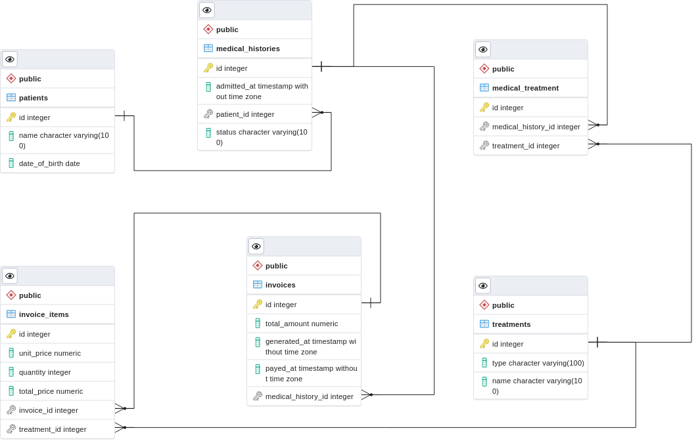

# Create a database based on a diagram

> For this project, we implemented the SQL needed to build a database based on an Entity Relationship Diagram (ERD).

## Getting Started

This repository includes files with plain SQL that can be used to recreate a database:

- Use [schema_based_on_diagram.sql](./schema_based_on_diagram) to create all tables.

## Entity Relationship Diagram (ERD)

  

## Authors

👤 **Jesús Vázquez**

- GitHub: [@jevazquezb](https://github.com/jevazquezb)
- Twitter: [@javb_1187](https://twitter.com/javb_1187)
- LinkedIn: [@jevazquezb](https://www.linkedin.com/in/jevazquezb)

## 🤝 Contributing

Contributions, issues, and feature requests are welcome!

Feel free to check the [issues page](https://github.com/jevazquezb/DB_from_diagram/issues).

## Show your support

Give a ⭐️ if you like this project!

## Acknowledgments

- My fellow Micronauts.
- Google and Stack Overflow.
- Inspiration.
- etc.

## 📝 License

This project is [MIT](./MIT.md) licensed.
